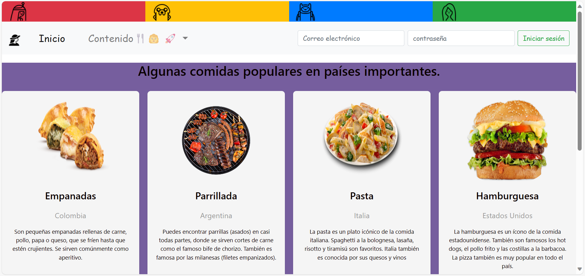
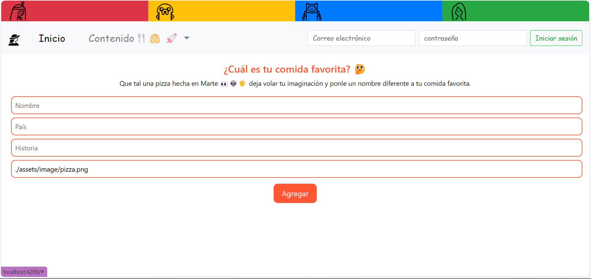
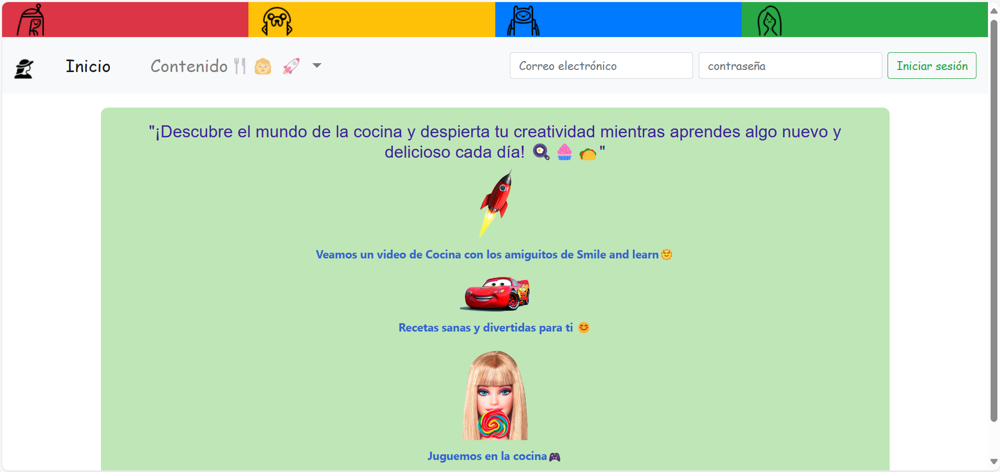

<div align="center">
  <h1>🍔 DeliciaExplorerKids🍴👩‍🚀</h1>
  
</div>

<!-- Descripción de alto nivel de tu proyecto -->
## Descripción

Bienvenidos a **Gastronomía para Niños**, una aplicación web educativa y divertida donde los más pequeños pueden explorar comidas importantes de todo el mundo mientras se divierten. Los niños podrán aprender sobre diversas culturas culinarias, agregar sus platos favoritos y disfrutar de videos y juegos relacionados con la gastronomía.

<!-- Ejemplo de características -->
## Características Destacadas

- 🌍 **Explora el Mundo**: Los niños pueden descubrir una variedad de platos tradicionales de diferentes países y explorar sus orígenes culturales.

- 🍕 **Agrega tus Comidas Favoritas**: Los usuarios pueden agregar sus comidas preferidas junto con imágenes y descripciones, compartiéndolas con otros entusiastas de la gastronomía.

- 🎮 **Diversión Educativa**: Accede a videos educativos y juegos interactivos relacionados con la comida y la cocina de todo el mundo.

<!-- Capturas de pantalla para ilustrar -->
## Capturas de Pantalla

<div align="center">
  
  
  
</div>

<!-- Cómo instalar y ejecutar tu proyecto -->
## Cómo Empezar

Sigue estos sencillos pasos para instalar y ejecutar la aplicación en tu entorno local:

1. **Clonar el Repositorio**:

   ```bash
   git clone https://github.com/TuUsuario/TuRepositorio.git
   cd TuRepositorio
